# Ikuyo Pet

Ikuyo Pet 是一个面向 Windows 的离线健康提醒与有效工作时间记录工具。它以透明、可拖动的桌宠作为主要提醒渠道，在桌宠关闭或不可用时回退到 Windows 原生通知，并把提醒响应与工作时长保存在本机。

> 当前项目是个人效率与健康提醒工具，不是医疗器械，也不提供诊断、治疗或个体化医疗建议。提醒间隔、饮水量和活动方式应以个人感受及医生意见为准。

## 界面与视觉预览

下面的截图来自本项目随附的 `kita` 材料目录，展示当前版本的主要页面和气泡方向：

<table>
<tr>
<td>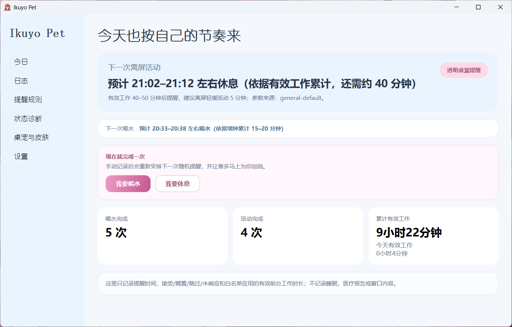</td>
<td></td>
</tr>
<tr>
<td>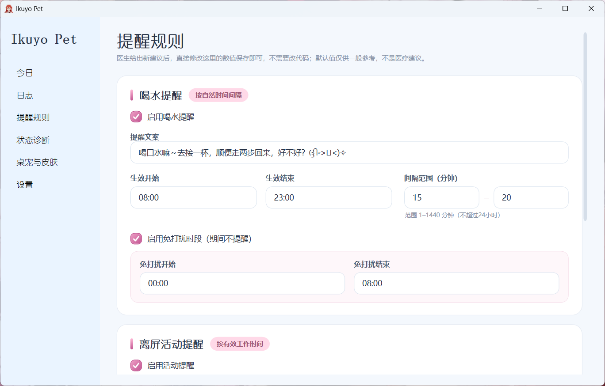</td>
<td>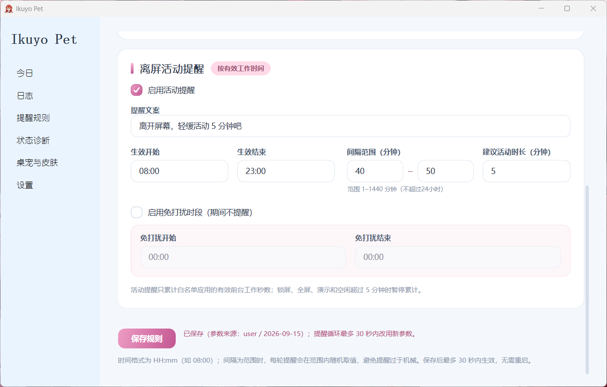</td>
</tr>
<tr>
<td>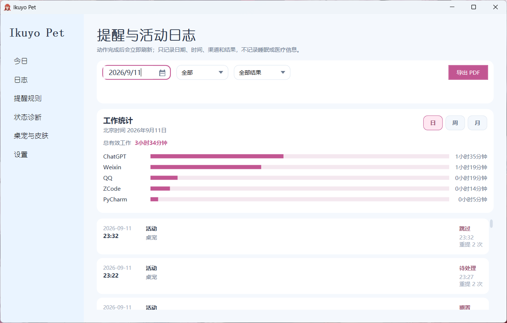</td>
<td>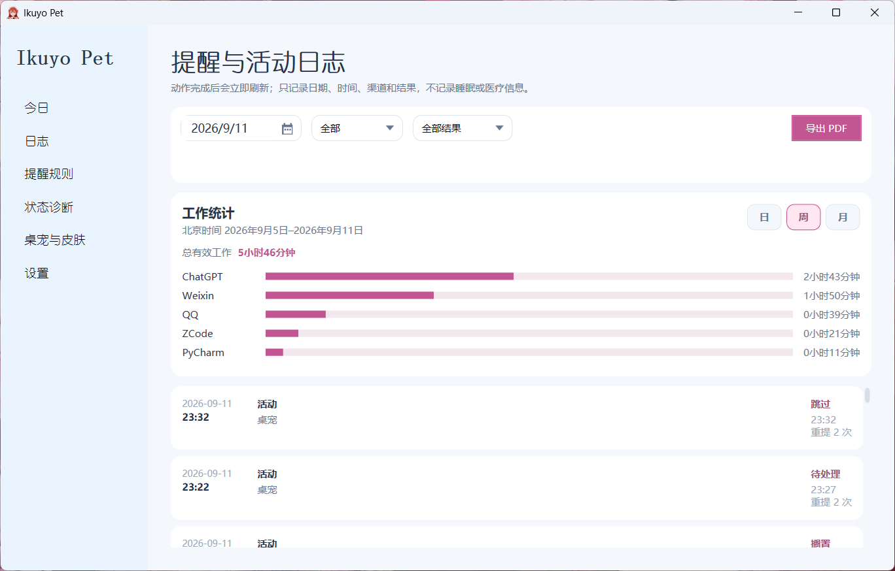</td>
</tr>
<tr>
<td>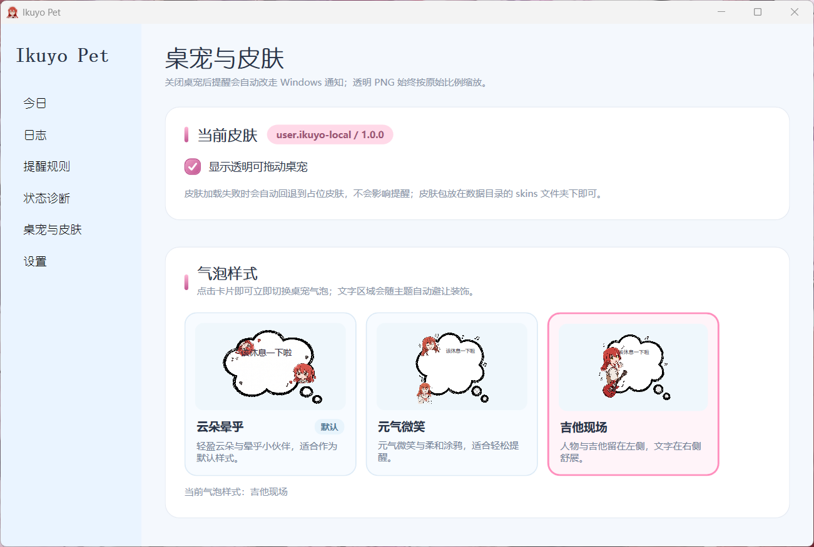</td>
<td>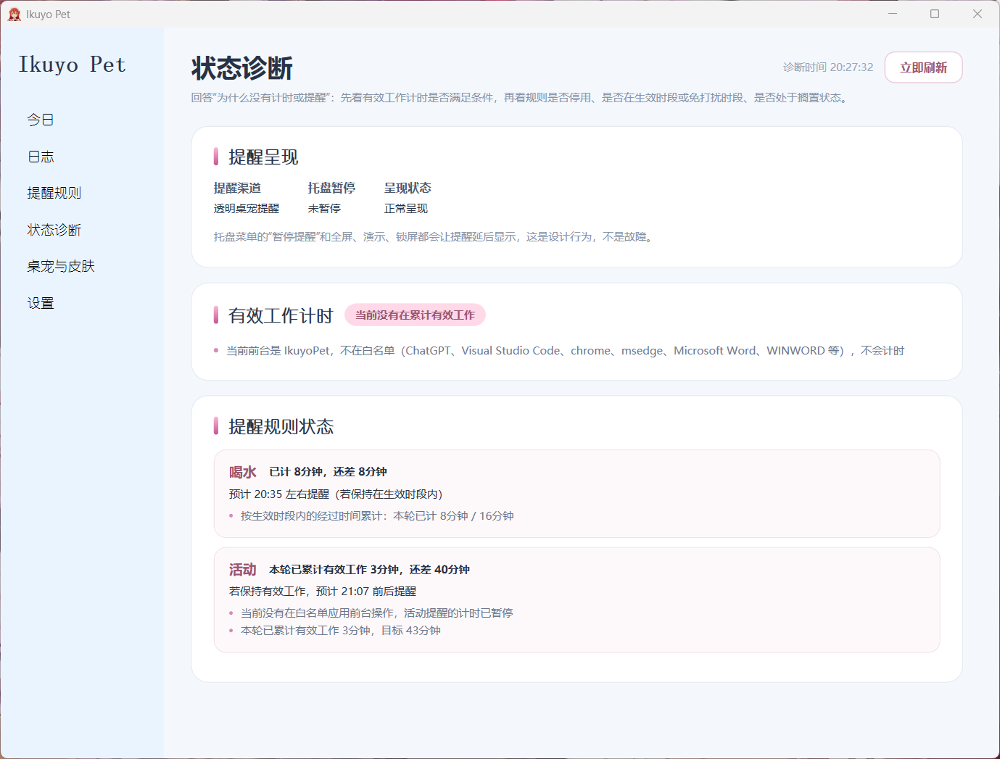</td>
</tr>
</table>
## 特性

### 提醒与调度

- 独立支持喝水提醒和离屏活动提醒，主页面分别显示「下一次喝水」与「下一次活动」；
- 支持启用 / 停用、生效开始与结束、随机间隔范围、活动建议时长、提醒文案和免打扰时段；
- 输入按 `HH:mm`、日期和分钟范围校验，非法格式、反向时间线和超过 24 小时的间隔不会保存；
- 喝水规则与活动规则先统一校验，再通过 SQLite 事务批量保存，任意一项失败时整批回滚；
- 提醒状态包含完成、稍后、跳过、未响应等结果，重复动作按事件和运行状态抑制；
- 支持跨午夜生效时段、程序重启恢复和本地时间展示；
- 主页面显示预计时间范围与原因，帮助用户判断提醒为什么还没有出现；
- 用户可以直接点击「我要喝水」或「我要休息」，立即记录动作、重置对应间隔并显示对应鼓励语。

### 桌宠、皮肤与气泡

- 透明、可拖动的桌宠窗口，不改变桌面背景；
- 三套手绘气泡主题，设置页以统一小卡片预览，默认选择第一套；
- 预览页和真实 `PetWindow` 共用气泡渲染组件，避免“预览正常、桌宠错位”；
- 气泡尺寸根据文本量扩展，短文本不空荡，长文本限制最大高度；
- 气泡外部保持透明，内部使用素材提供的整体白色内腔，不叠加“气泡中的气泡”；
- 装饰人物、吉他和涂鸦保持原比例；第二套主题为左侧人物预留文字安全区；
- 气泡位于桌宠左上方，右下角尾部指向桌宠上半身；气泡出现 / 消失时保留桌宠屏幕锚点，不让人物跳动；
- 皮肤和气泡选择写入本机配置，资源损坏或未知 ID 时安全回退到默认资源。

#### 气泡主题演进

气泡最终效果建立在多轮素材与布局调整上，重点是文字安全区、整体白色内腔、外部透明和桌宠锚点：

<table>
<tr>
<td>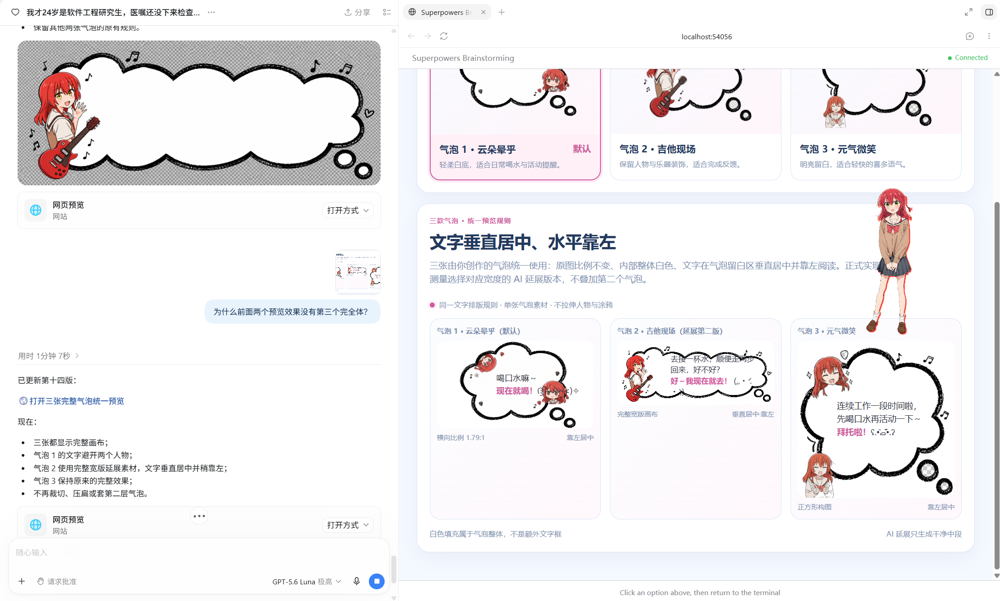</td>
<td>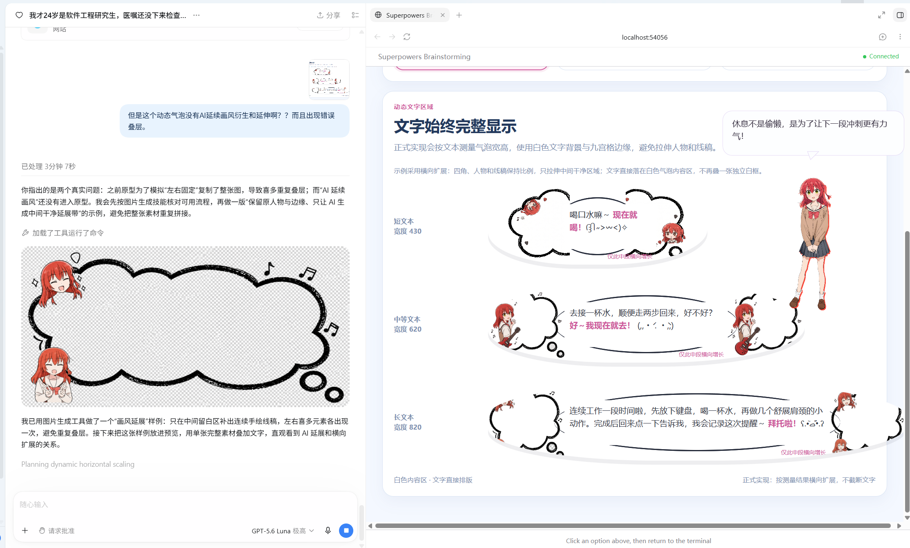</td>
</tr>
<tr>
<td></td>
<td></td>
</tr>
</table>
### 工作统计与日志

- 只有白名单进程处于前台、电脑未锁屏、不在全屏 / 演示模式且最近有操作时，才累计有效工作时间；
- 日志页支持日期、类型和结果筛选；
- 工作统计支持日、周、月范围，显示总有效工作时长和前五应用横向柱状图；
- 记录提醒日期、时间、渠道、结果和重提次数，不记录窗口标题、文档内容、文件名或键鼠内容；
- 支持离线导出当前筛选范围的 A 版 PDF；
- 支持手动备份、恢复和全部数据 JSON 导出。

### 诊断与维护

- 状态诊断页显示当前提醒渠道、暂停 / 抑制原因、下一次预计时间、规则状态和有效工作计时原因；
- 设置页可以读取当前运行进程名称和 PID，选择后填入白名单；
- 提供 5 秒计时可用性测试，区分前台、锁屏、全屏和空闲等失败原因；
- 运行健康注册表记录提醒循环和工作追踪循环的开始、成功、失败、下一次唤醒和最近提醒信息；
- 气泡图片、前台探针和进程列表使用缓存，降低重复读取开销。

## 隐私边界

项目默认离线运行，个人数据保存在当前 Windows 用户的本地应用数据目录中，不上传云端。应用不会记录：

- 睡眠时间或医疗报告；
- 窗口标题、文档内容、文件名或网页内容；
- 键盘输入和鼠标输入内容；
- 屏幕截图、屏幕录制或桌面画面。

有效工作统计只保留白名单进程标识、时间段和累计时长。进程诊断只读取进程名和 PID，不读取窗口标题或内容。

## 环境要求

- Windows 10 版本 2004（Build 19041）或更高版本；
- .NET 10 SDK；
- 不需要管理员权限；
- 使用嵌入式 SQLite，不需要额外安装数据库服务。

## 本地运行

在仓库根目录执行：

```powershell
dotnet restore .\IkuyoPet.sln
dotnet build .\IkuyoPet.sln --configuration Release --no-restore -warnaserror
dotnet test --solution .\IkuyoPet.sln --configuration Release --no-build --no-restore
dotnet run --project .\src\IkuyoPet.App\IkuyoPet.App.csproj
```

如果本机存在指定的 .NET 10 工具链，可以设置：

```powershell
$env:IKUYO_PET_DOTNET = 'G:\IkuyoPetDev\dotnet\dotnet.exe'
```

## 发布方式

开发和测试版本统一发布到：

```text
artifacts/publish/latest/
```

桌面快捷方式和人工验收始终指向 `latest`，不再指向 `v1`、`v2` 等历史目录。发布脚本会：

1. 在临时 staging 目录生成自包含 `win-x64` 应用；
2. 检查可执行文件版本与项目版本一致；
3. 检查三套气泡主题的清单、源图和填充图；
4. 计算资源 SHA-256；
5. 同时发布 `IkuyoPet.Uninstaller.exe`，并记录卸载器版本和 SHA-256；
6. 写入 `build-info.json`，包含版本号、文件版本、Git 提交和构建时间；
7. 原子替换 `artifacts/publish/latest`，失败时保留旧目录。

运行发布与校验：

```powershell
powershell -NoProfile -ExecutionPolicy Bypass -File .\scripts\publish-latest.ps1
powershell -NoProfile -ExecutionPolicy Bypass -File .\eng\verify-dev.ps1 `
  -PublishRoot .\artifacts\publish\latest
```

当前验证过的发布包位于：

```text
G:\testPet\artifacts\publish\latest\IkuyoPet.exe
```

### 卸载

发布目录同时包含 `IkuyoPet.Uninstaller.exe`。双击它会显示三个选项：

- **是：保留数据并卸载**：删除程序文件和指向当前 `latest` 的桌面快捷方式，保留 `%LOCALAPPDATA%\\IkuyoPet` 中的设置、日志、数据库和备份；
- **否：删除数据并卸载**：在上面的基础上删除本地应用数据；
- **取消**：不做任何修改。

卸载器只接受包含 `IkuyoPet.exe` 与 `build-info.json` 的发布目录，不会删除源码、`local-assets/`、`local-skins/` 或其他版本目录。若桌宠仍在运行，先退出桌宠再重试。

## 项目结构

```text
src/
  IkuyoPet.App/             WPF 主程序、主窗口、规则、日志、诊断和托盘
  IkuyoPet.Core/            提醒状态机、工作统计、气泡和诊断领域逻辑
  IkuyoPet.Infrastructure/ SQLite、Windows API、通知、备份、发布资源
  IkuyoPet.Uninstaller/   发布目录安全校验与可选数据清理
  IkuyoPet.Pet/             透明桌宠窗口、拖动、锚点和气泡合成
tests/
  IkuyoPet.Core.Tests/
  IkuyoPet.Infrastructure.Tests/
assets/                     可公开分发的默认资源与回退文案
schemas/                    皮肤和互动文案 JSON Schema
docs/superpowers/           设计规格、实现计划、手工测试和执行记录
local-assets/               本机私有品牌、图标和互动文案，Git 忽略
local-skins/                本机私有皮肤，Git 忽略
```

## 测试

当前测试重点包括：

- 提醒状态机、完成 / 搁置 / 跳过和重复事件；
- 随机间隔、跨午夜、免打扰、生效时段和程序重启恢复；
- SQLite 规则批量事务与失败回滚；
- 日 / 周 / 月统计、跨日工作时长和日志筛选；
- 气泡主题选择、资源回退、文字尺寸、透明外部和白色内部；
- 桌宠屏幕锚点、拖动 / 点击判定和气泡显示优先级；
- 运行进程读取、缓存、强制刷新和 5 秒计时诊断；
- 发布目录、版本号、资源哈希和公开回退资源。

最后一次 Release 验证结果：417 / 417 测试通过，构建 0 个警告、0 个错误。

## 版权、角色素材与开源范围

### 代码

项目代码采用 MIT License，许可证文件位于仓库根目录 `G:\testPet\LICENSE`。第三方依赖遵循各自许可证。

### 三套原创气泡

本项目的三套手绘气泡素材由项目发起人声明为本人创作，并同意将其作为项目素材随代码开源。实际发布时仍应保留素材来源和授权说明；如果素材的来源、作者或许可范围发生变化，应以最新授权文件为准。

### 第三方角色与皮肤

公开仓库和公开发布包不包含任何未经许可的第三方动漫角色图片、立绘、动画、语音、Logo 或其他商业素材。用户可以在本机导入自己有权使用的皮肤，但必须自行确认：

- 角色和图片来源允许本地使用；
- 如果要再分发，许可明确允许复制、修改和公开传播；
- 不把第三方素材放进 Git 跟踪的 `assets/`、公开发布包或项目截图仓库。

本项目不会因为素材被放在本机、被标记为“非商业”或被写入“侵权即删除”就自动获得复制和公开传播权。若权利人提出可信通知，项目维护者会及时停止分发相关素材、移除公开文件，并根据情况更新说明；这不代表对权利归属作出法律判断。

### 私有素材

`local-assets/` 和 `local-skins/` 默认被 Git 忽略，只用于当前电脑构建和运行。发布脚本可以使用它们生成本机私有版本，但不会把它们自动加入公开仓库。

## 贡献与开发约定

欢迎提交代码、测试和文档改进。提交前请：

1. 先写或更新能复现行为的测试；
2. 运行 Debug / Release 的相关测试；
3. 运行完整 `dotnet test --solution .\IkuyoPet.sln`；
4. 检查 `git diff --check`；
5. 如果涉及资源，确认公开资源和本机私有资源边界没有被破坏；
6. 如果涉及 UI，补充截图或视觉回归矩阵说明。

## 已知限制与后续路线

以下事项仍属于后续工作，不应在发布说明中写成已经完成：

- 完整的应用环境、资源哈希和数据库健康探针卡片；
- 诊断信息脱敏导出与本地滚动日志；
- 系统睡眠、系统时间变化、跨午夜和时区切换的长期耐久测试；
- 无障碍键盘导航和屏幕阅读器回归；
- 三主题 × 短 / 中 / 长文本 × 100% / 125% / 150% DPI 的自动视觉回归；
- 更完整的自有素材来源和许可证清单。

## 材料图集

`kita` 文件夹还保留了设置、诊断、非法时间输入和桌宠互动的原始截图，便于贡献者复现需求背景：

<details>
<summary>展开材料图集</summary>

<table>
<tr>
<td>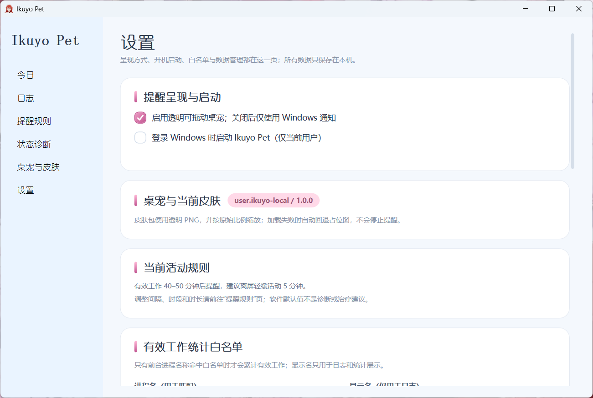</td>
<td>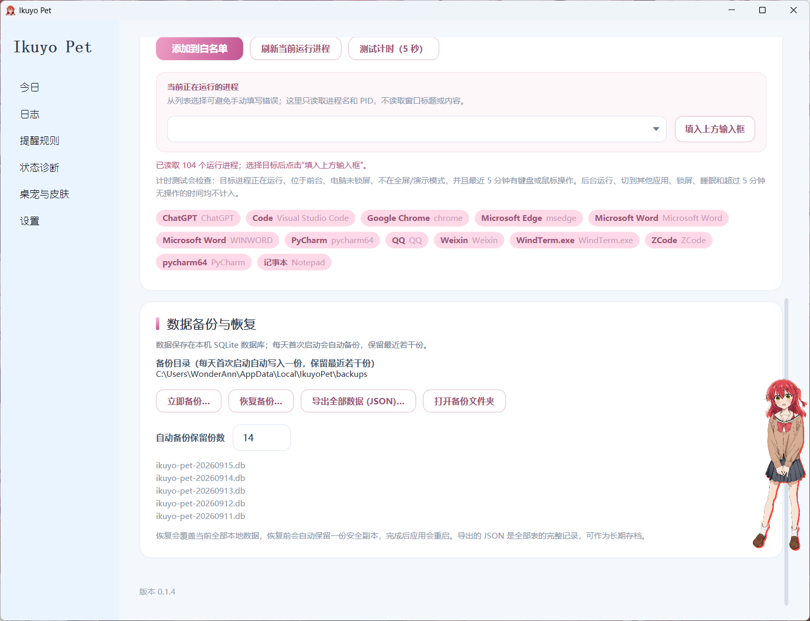</td>
<td>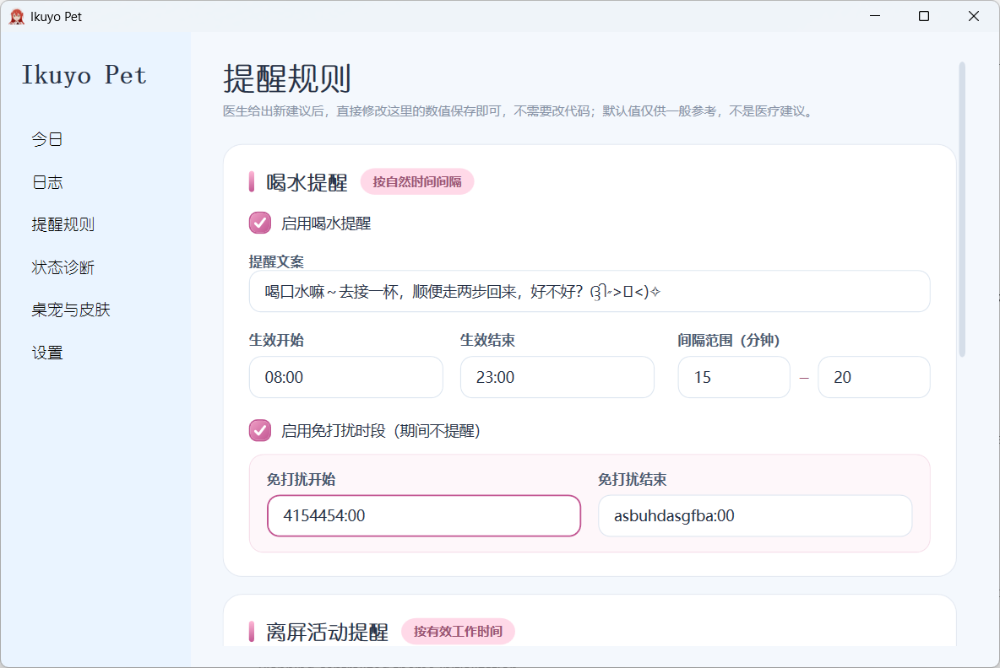</td>
</tr>
<tr>
<td></td>
<td>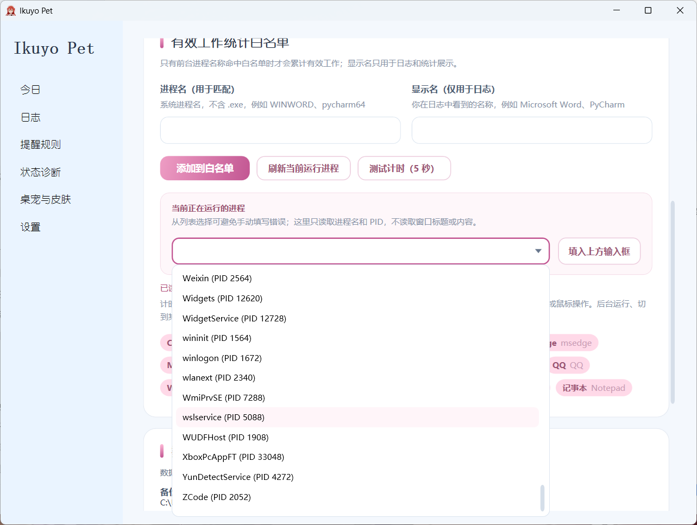</td>
<td>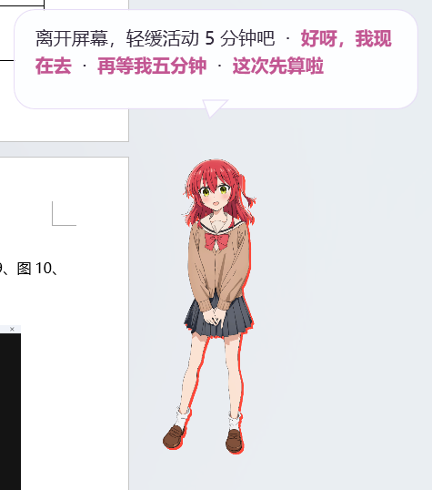</td>
</tr>
<tr>
<td>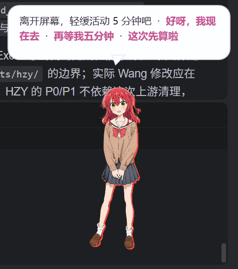</td>
<td>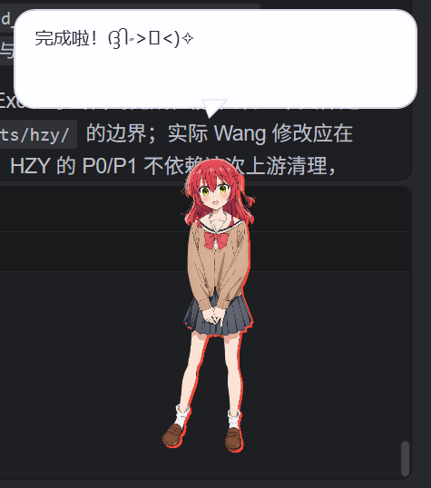</td>
<td>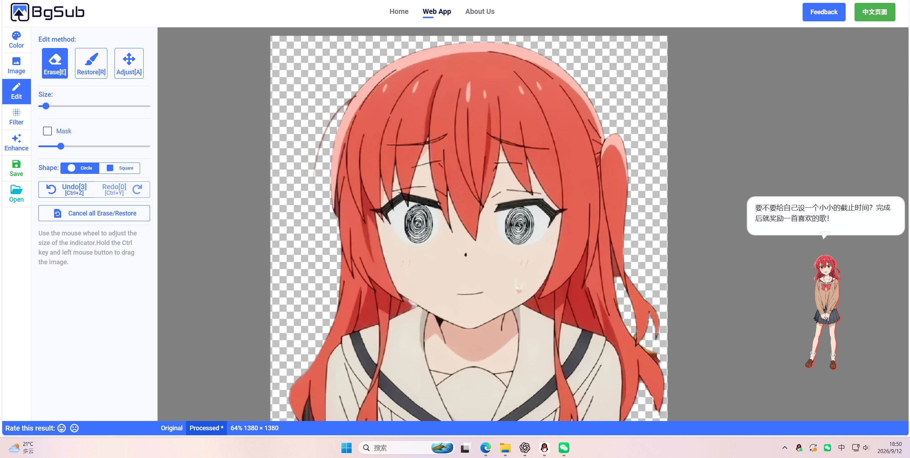</td>
</tr>
<tr>
<td>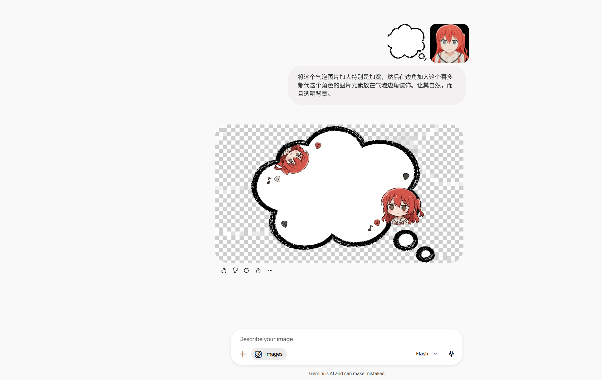</td>
<td></td><td></td>
</tr>
</table>

</details>

## 材料逐项用途对照

`kita` 中的每个文件都对应一个具体的产品问题或验收目标。以下不是简单的文件清单，而是“材料 → 功能证据”的说明，方便贡献者知道该看什么、为什么看。

| 材料 | 用途与验收点 |
|---|---|
| [主页面.png](./docs/assets/kita/主页面.png) | 首页证据：区分下一次活动与下一次喝水，展示预计时间范围、原因、完成次数和有效工作时长。 |
| [最终气泡.png](./docs/assets/kita/最终气泡.png) | 三套气泡统一预览：验收默认主题、文字安全区、外部透明和内部白色填充。 |
| [提醒规则-上.png](./docs/assets/kita/提醒规则-上.png) | 喝水规则上半区：验收启用状态、文案、生效起止时间、随机间隔和输入对齐。 |
| [提醒规则-下.png](./docs/assets/kita/提醒规则-下.png) | 活动规则与免打扰下半区：验收活动时长、免打扰时段和事务式保存区域。 |
| [提醒与活动日志.png](./docs/assets/kita/提醒与活动日志.png) | 日志筛选和导出入口：验收日期、类型、结果控件及导出反馈。 |
| [周统计-提醒与日志.png](./docs/assets/kita/周统计-提醒与日志.png) | 统计切换证据：验收日、周、月周期、应用时长条和提醒时间线的独立联动。 |
| [皮肤设定.png](./docs/assets/kita/皮肤设定.png) | 皮肤选择证据：验收三套卡片、默认第一套、点击选择和透明桌宠开关。 |
| [状态诊断.png](./docs/assets/kita/状态诊断.png) | 诊断页证据：验收版本、资源路径、主题、调度器、最近提醒和进程检测状态。 |
| [修改14次气泡.png](./docs/assets/kita/修改14次气泡.png) | 气泡迭代记录：说明空荡、套泡、越界、比例和文字方向问题是如何被逐步发现的。 |
| [搓气泡.png](./docs/assets/kita/搓气泡.png) | 手绘气泡素材处理：验收涂鸦边缘、装饰比例和整体白色内腔。 |
| [提醒喝水.png](./docs/assets/kita/提醒喝水.png) | 运行时喝水提醒：验收提醒文字不被人物/装饰遮挡，并落在白色安全区内。 |
| [喝水完成.png](./docs/assets/kita/喝水完成.png) | 喝水完成反馈：验收完成动作触发对应鼓励语并重置下一次喝水计时。 |
| [抠图.png](./docs/assets/kita/抠图.png) | 人物透明抠图素材：验收 PNG 边缘、比例和合成时无白底。 |
| [生图.png](./docs/assets/kita/生图.png) | AI 生图素材探索：记录涂鸦风格来源，区别于最终运行时布局。 |
| [设置-上.png](./docs/assets/kita/设置-上.png) | 设置上半区：验收进程白名单、测试入口和运行状态说明。 |
| [设置-下.png](./docs/assets/kita/设置-下.png) | 设置下半区：验收备份、恢复、数据管理和维护说明。 |
| [选取进程.png](./docs/assets/kita/选取进程.png) | 进程选择修复：验收下拉框可点开、与上方输入框对齐，并能填入进程名/PID。 |
| [时间BUG.png](./docs/assets/kita/时间BUG.png) | 时间校验回归来源：覆盖非法格式、反向时间线和超过 24 小时间隔。 |
| [QQ20260910-170426.png](./docs/assets/kita/QQ20260910-170426.png) | 早期桌宠实机证据：复核透明窗口边界、气泡锚点和人物位置。 |
| [QQ20260910-210441.png](./docs/assets/kita/QQ20260910-210441.png) | 互动实机证据：复核文字换行、气泡尾部方向和人物相对位置。 |
| [QQ20260910-210450.png](./docs/assets/kita/QQ20260910-210450.png) | 桌宠回归证据：复核气泡出现/消失不推动人物，以及长文本不越界。 |
| [日志示例.pdf](./docs/assets/kita/日志示例.pdf) | A4 单页离线日志导出样例（1 页）：验收导出文件、标题/日期、统计摘要与提醒记录的可读排版。 |

> [打开日志示例 PDF](./docs/assets/kita/日志示例.pdf)。PDF 保留为原始可下载文件，不伪装成截图。
## 免责声明

Ikuyo Pet 用于帮助用户执行自己设定的日常提醒和记录工作节奏。软件默认参数不是医疗建议，软件的提醒也不能替代医生、职业治疗师或其他专业人员的意见。请根据个人情况调整规则，发现不适时停止使用并寻求专业帮助。
